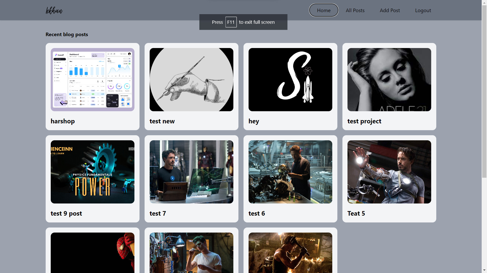
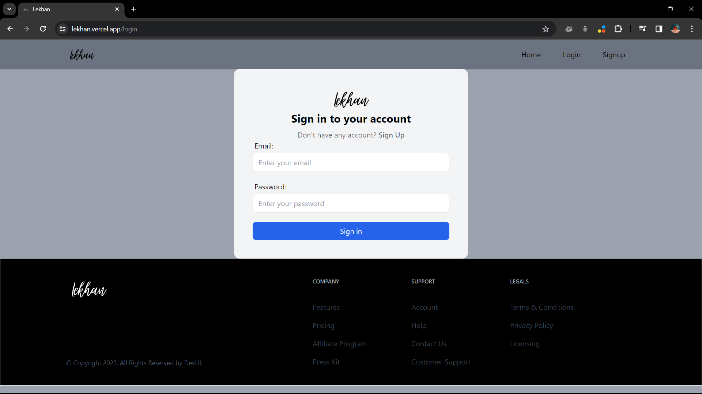
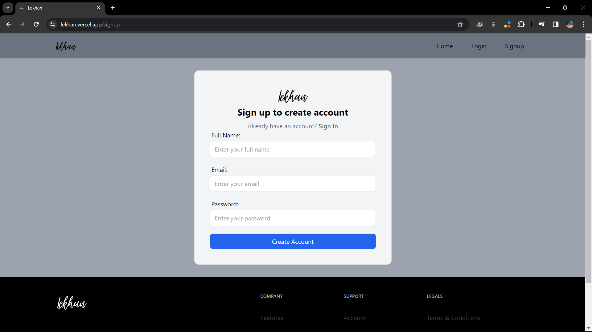
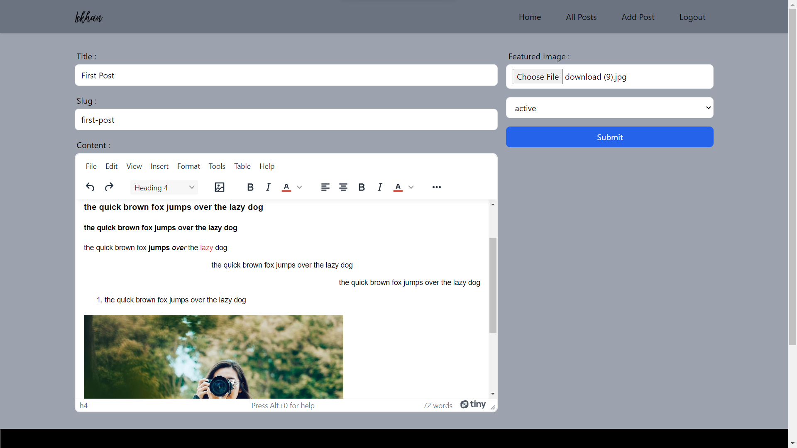
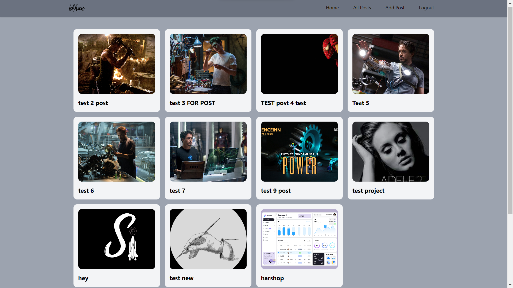
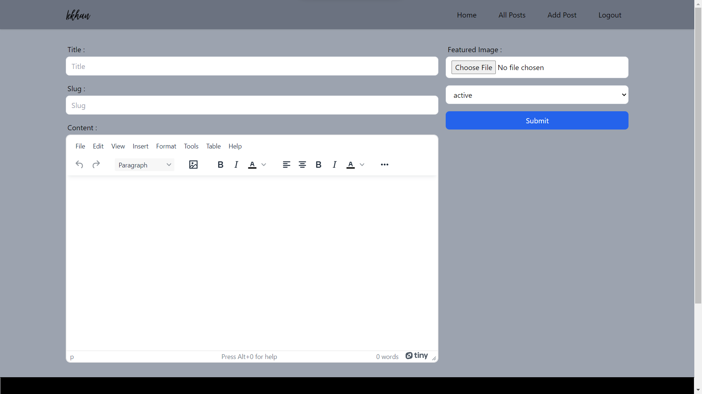
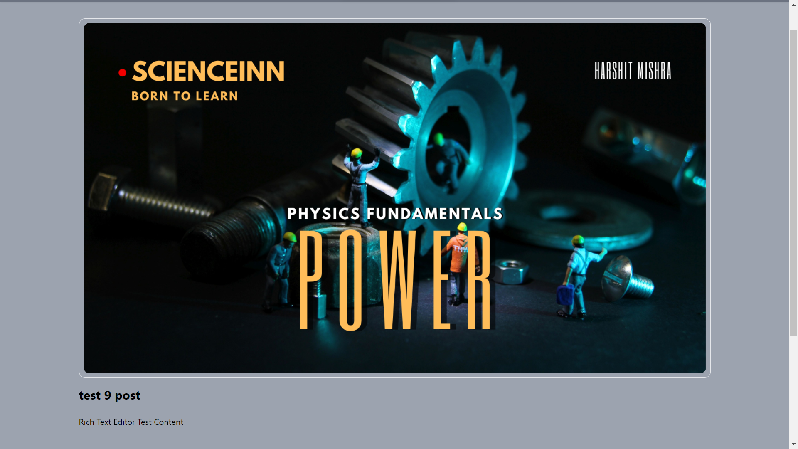
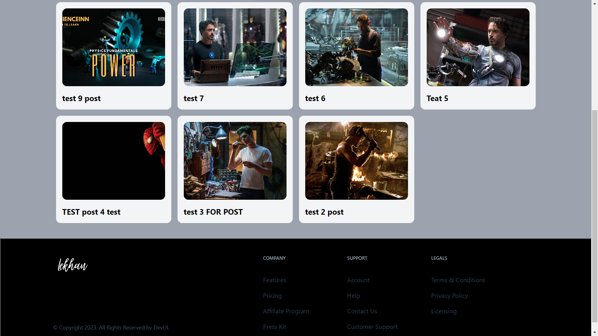

# 12MegaBlog - A React App for Mega Blogging

12MegaBlog is a modern web application built with React.js, utilizing Appwrite for backend services. It provides a platform for users to create, edit, and view blog posts. The project emphasizes a clean, modular, and responsive design.

## Features

- **User Authentication:** Secure user accounts with Appwrite Authentication.
- **Post Management:** Create, edit, and delete blog posts.
- **Rich Text Editor:** A powerful WYSIWYG editor for composing posts.
- **Responsive Design:** Tailwind CSS ensures a seamless experience on various devices.

## Screenshots

### Hero Section


### Home


### Login


### Signup


### Add Post


### All Posts


### Post Editor


### Single Post


### Footer


## Getting Started

1. Clone the repository: `git clone https://github.com/your-username/12MegaBlog.git`
2. Install dependencies: `npm install`
3. Start the development server: `npm start`

## Technologies Used

### Frontend

- React.js
- JavaScript (ES6+)
- React Router for navigation
- Tailwind CSS for styling

### Backend

- Appwrite for backend services
- Appwrite Authentication

### Additional Libraries

- Redux (for state management)
- React Spinners (ClipLoader) for loaders
- React Router DOM for routing

## Project Structure

```
12MegaBlog/
|-- public/
|-- src/
|   |-- appwrite/
|   |-- components/
|   |-- pages/
|   |-- app.js
|   |-- index.js
|-- .gitignore
|-- package.json
|-- README.md
|-- ... (other project files)
```

## License

This project is licensed under the MIT License - see the [LICENSE](LICENSE) file for details.

Feel free to adjust the content as per your actual project details.


# React + Vite

This template provides a minimal setup to get React working in Vite with HMR and some ESLint rules.

Currently, two official plugins are available:

- [@vitejs/plugin-react](https://github.com/vitejs/vite-plugin-react/blob/main/packages/plugin-react/README.md) uses [Babel](https://babeljs.io/) for Fast Refresh
- [@vitejs/plugin-react-swc](https://github.com/vitejs/vite-plugin-react-swc) uses [SWC](https://swc.rs/) for Fast Refresh


npm i @reduxjs/toolkit 
react-redux 
react-router-dom 
appwrite 
@tinymce/tinymce-react 
html-react-parser 
react-hook-form


Certainly! Below is a sample README for your project. Please replace the placeholder text and image filenames with your actual project details.

---